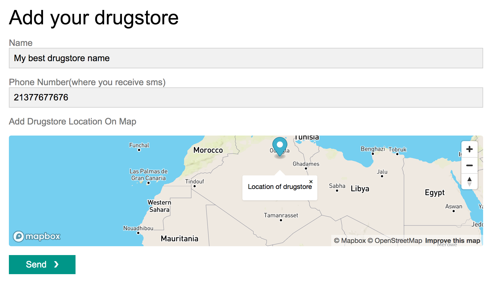
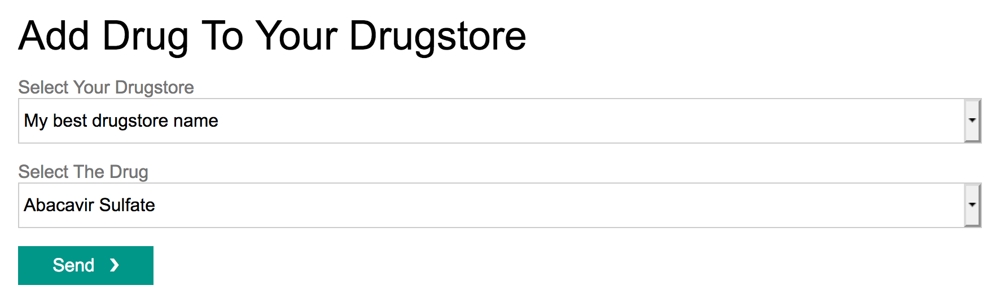
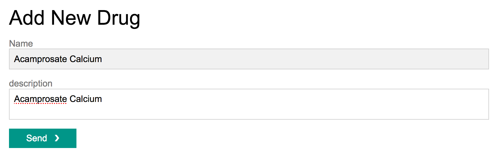
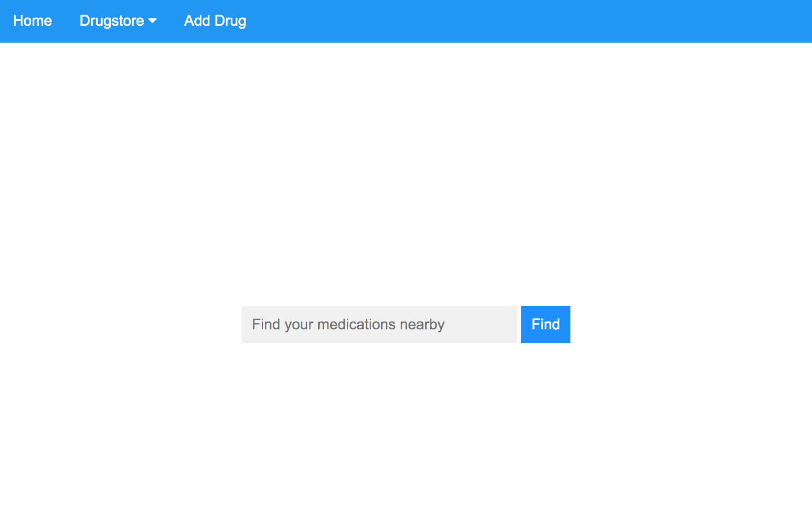
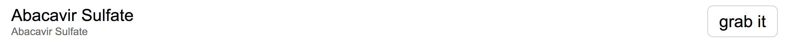
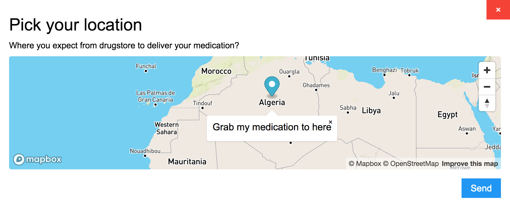

# Pharmap App

## About

This is an app to connect users and drugstores nearby. At this pandemic most of coutries are on lockdown, so this app can help sick peoples to get there medications delivred to home without going out and risk there life to COVID19. You can give it a [shot here](https://pharmaappp.herokuapp.com/) for more detail see the next section.

## Requirements
1. Install [Node.js](https://nodejs.org/) and yarn or npm
2. Mysql database
3. Twilio account to send sms

## Setups for local dev
1. Of course clone the repos
2. Create a mysql database
3. Run this commande from your terminal: `cp .env.example .env` to use it as environment variables
4. fill all fields on .env file from getting [twilio account sid and auth token](https://www.twilio.com/console) to db credentials
5. Run `yarn` or `npm install`
6. Finally run on cli `yarn dev` or `npm run dev`

## How it works
To use pharmaappp you dont need to create an account or signin process.
To add a drugstore just visit [this](http:localhost:3000/add-drugstore) then fill the inputs and select the location of your store



after that you need to add medication are available on your store [from here](http:localhost:3000/add-drug-to-store) by selecting your drugstore name then the medication to add



however if the medication are not available you can add it [from here](http:localhost:3000/add-drug) 



and that it, now you can receive all order from your phone number via SMS.
To order the medication from [home page](http:localhost:3000/) 



by searching the name of medication and pressing find then select the medication by clicking *grab it*



after that select your location



then click send to send your order to closest drugstore(far from your location by less than 10Km or 6.2Miles) who has the medication then the drugstore bring your asked medication to your location(home) without risking your life by going out to grab it.

```javascript
alert('Please stay at home and stay healthy.');
```